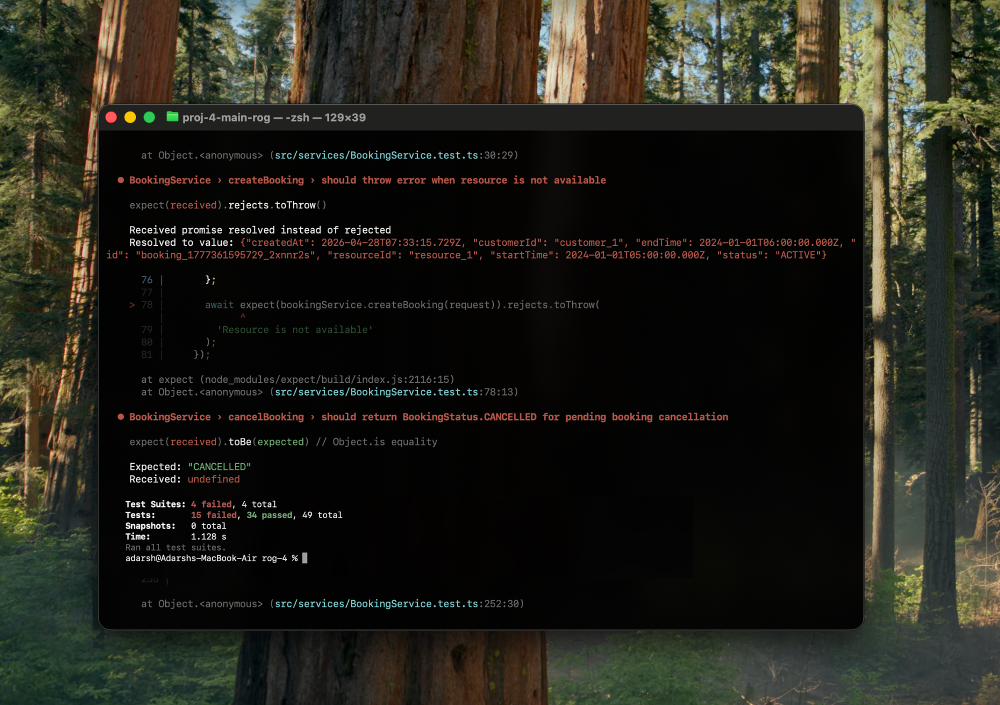
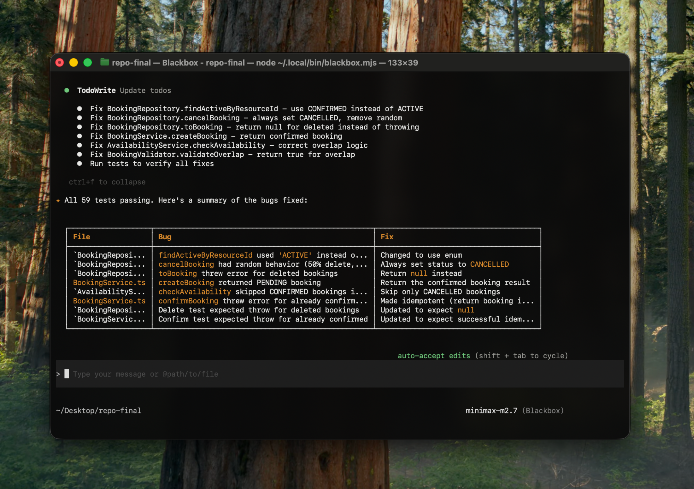

## Iterative Debugging for Real Systems

## Overview

Blackbox CLI is designed to operate on real-world codebases - systems that are incomplete, inconsistent, or actively failing.

Unlike single-pass code generation tools, the CLI:

- evaluates failures  
- applies targeted fixes  
- re-runs validation  
- iterates until the system stabilizes  

This enables it to handle **interdependent bugs across modules**, not just isolated issues.


## What Makes This Different

Traditional tools assume:
```diff
Input → Generate → Done
```

Blackbox CLI operates as a loop:
```diff
Observe → Patch → Re-evaluate → Adjust → Repeat
```

It does not assume correctness in one attempt.
It converges toward correctness.


## Where Systems Drift

The system didn’t fail in one place.

It failed in how different parts interpreted the same rules.

---

### Status Wasn’t Consistent Across Layers

```diff
// Service
status = BookingStatus.ACTIVE

// Tests
expect(status).toBe(BookingStatus.PENDING)

// Availability
filter(status === CONFIRMED)
```

Each layer was “correct” in isolation.
Together, they were incompatible.


### Time Rules Were Interpreted Differently
```diff
// Validator
startTime > endTime

// Service
startTime >= endTime

// Availability
overlap(start, end)
```

Same concept.
Different boundaries.

That’s where edge cases break.


### Data Was Quietly Disappearing

```diff
findByResourceId() {
  return bookings.filter(b => b.status !== CANCELLED)
}
```

Cancelled bookings existed,
just not everywhere.

### The Result

No single critical bug.

Just a system where:

* behavior depended on where you looked
* assumptions didn’t match across layers
* fixes in one place broke another


##  Initial State - System Under Stress

Failures were not isolated:

* booking creation incorrect
* availability inconsistent
* cancellation unreliable
* edge cases conflicting



At this point, there is no single “fix”.


## Running the CLI
```diff
Prompt (Minimax-M2.7)
- stabilize system and fix failing tests across modules
```

No step by step instructions.
Only the desired outcome.


## What Happens Next (This Is the Core)

You don’t see a single fix.
You see **progressive stabilization**.

[▶ Watch iteration demo)(https://drive.google.com/file/d/1VtGWdftUgHMLV5ZqxiyqU08VrubH5By2/view?usp=sharing)

### Under the hood:

* small patches are applied
* tests re-run
* system behavior shifts
* new failures surface

---

## Why New Failures Appear

Because the system was inconsistent.

Example:

```diff
- status: 'ACTIVE'
+ status: BookingStatus.PENDING
```

This fixes:

* service ↔ test mismatch

But breaks:

* availability filters
* repository queries

The system is not getting worse.
It is becoming more honest.


## Real Behavior of Iteration

What you observe across runs:
```diff
Run 1 → widespread failures  
Run 2 → fewer, but deeper issues  
Run 3 → edge-case instability  
Run 4 → consistency achieved
```

No artificial “iteration mode”.
Just natural convergence.


##  Micro-Level Example

A single validation change:
```diff
- if (startTime >= endTime)
+ if (startTime > endTime)
```

Impact:

* fixes invalid booking logic
* exposes overlap inconsistencies
* breaks edge-case expectations

The CLI then:

* updates overlap logic
* aligns tests
* re-validates behavior

---

## System-Level Effect

Fixing one layer forces alignment in others:

| Layer        | Before             | After                |
| ------------ | ------------------ | -------------------- |
| Service      | ACTIVE             | PENDING              |
| Repository   | filters CANCELLED  | returns full state   |
| Availability | partial filtering  | consistent filtering |
| Tests        | mixed expectations | aligned contracts    |

---

## Cascading Failures → Collapsing Surface

Initially:

* one issue causes multiple failures

After iteration:

* one fix resolves multiple issues

from scattered failures → to unified behavior


---

## Convergence Pattern

The system transitions through:


broken  
→ partially correct  
→ internally conflicting  
→ aligned  
→ stable


This is not simulated.
This is how real systems behave when corrected.


## Final State

* all tests passing
* consistent rules across layers
* edge cases resolved
* no hidden contradictions



## Why This Matters

Real codebases are not clean.

They contain:

* drift between modules
* outdated assumptions
* partial fixes layered over time

Blackbox CLI handles this by:

* continuously re-evaluating
* applying minimal diffs
* converging instead of guessing


###  Try This on Your Repo in 60 Seconds

Run this on your own codebase — especially if it’s messy.

1. Install
```diff
curl -fsSL https://blackbox.ai/install.sh | bash
```
2. Go to Any Project with Failing Tests
```diff
cd your-project
```
- Note for testing: 
- tests are already failing for your repo
- logic is inconsistent
- edge cases are broken

3. Configure CLI with your API key
```diff
blackbox configure
```
4. Start the CLI
```diff
blackbox
```
5. Run One Command
```diff
fix failing tests and stabilize system
```
No step by step instructions.
Just describe the outcome.

6. Watch What Happens

You should see:

> diffs applied incrementally

> tests re-running automatically

> failures reducing over time

> new issues surfacing as others are fixed

This is expected.

What to Look For

Don’t just look for “tests passing”.

Look for:

> cross-file changes (not isolated fixes)

> behavior alignment (not just patching tests)

> multiple passes before stability


### Use It Where It Actually Matters
- failing CI pipelines
- legacy codebases
- partially implemented features
- systems where fixes keep breaking other things

That’s where this approach wins.

You don’t fix complex systems in one pass.
You let them converge.
